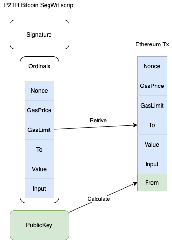
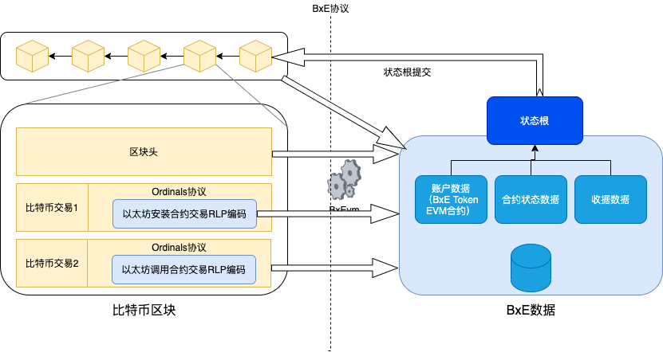
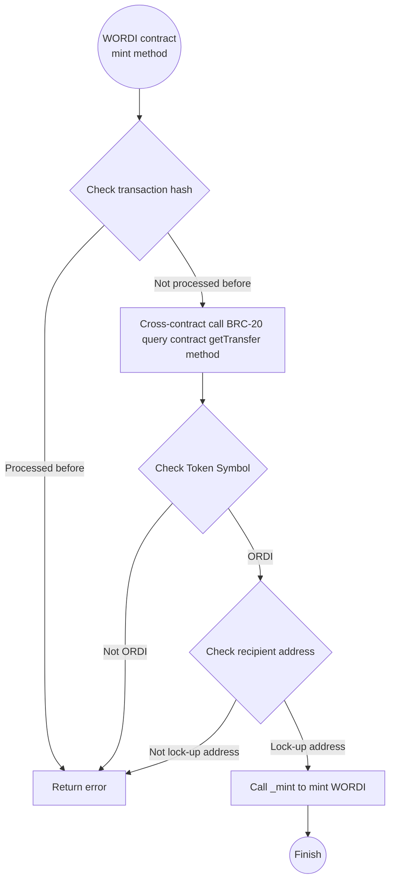
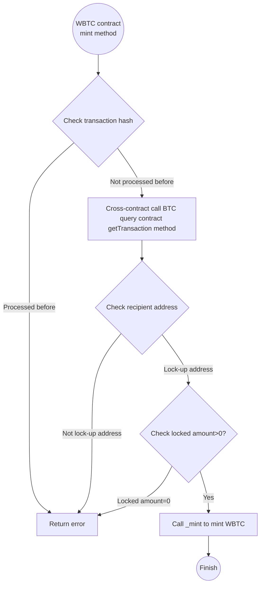

# BxE Protocol White Paper
## 1. BxE Project Background

Since the birth of blockchain technology, it has brought revolutionary innovations to the fields of finance, supply chain, digital identity, and more. However, as the first successful application of blockchain technology, Bitcoin has some limitations, such as relatively low transaction throughput, high energy consumption, and limited script functionality. This makes Bitcoin unable to fully support complex applications and smart contracts.

To solve these problems, the Bitcoin community has proposed many solutions, one of which is the Ordinals protocol. The Ordinals protocol embeds data in Bitcoin transactions, allowing developers to implement more complex logic and functions on the Bitcoin network. Although Ordinals has to some extent made up for Bitcoin's shortcomings, it still has some flaws, such as lower data storage efficiency and poorer interoperability.

Furthermore, with the rise of Ethereum and other smart contract platforms, a new protocol called BRC-20 has emerged. BRC-20 attempts to achieve token issuance and trading functions similar to Ethereum on the Bitcoin network. However, due to the fundamental differences between the Bitcoin network and the Ethereum network, BRC-20 has certain limitations in terms of performance and security.

Given this, the BxE project aims to break the existing framework and build a new blockchain infrastructure based on the Bitcoin network that supports Turing-complete smart contracts and is compatible with the Ethereum ecosystem. By introducing advanced consensus algorithms, optimizing data storage structures, and improving cross-chain interoperability, the BxE project is expected to bring users more efficient, secure, and user-friendly blockchain services.

To achieve this goal, the BxE project has adopted the following strategies:

1. Utilize the Ordinals protocol to implement smart contract support on the Bitcoin network, encapsulating and converting the creation of smart contract transactions and contract call transactions.
2. By building an EVM (Ethereum Virtual Machine) compatible with the Ethereum network, achieve cross-chain interoperability, allowing Ethereum smart contracts to run on the Bitcoin network.
3. Design and implement a complete set of system contracts, including the Bitcoin query system contract, Ordinals contract, and BRC-20 system contract, to provide users with a rich set of functions and a convenient operating experience.
4. Establish a BxEvm Jsonrpc gateway to facilitate users' query of contract execution results, Bitcoin block and transaction information, Ordinals inscription data, and BRC-20 transaction details.

Through these measures, the BxE project is expected to bring new vitality to the Bitcoin network and promote the widespread application and development of blockchain technology in various fields.

## 2. BxE Project Overview
### 2.1 Project Objectives
**The BxE Protocol (Bitcoin x Ethereum Protocol)** aims to fully utilize the powerful security, decentralization, and vast network effects of Bitcoin, and build a new generation of programmable and cross-ecosystem interconnected blockchain ecosystem on its foundation. Through innovative technical design, BxE will become a bridge connecting the Bitcoin and Ethereum Web3 ecosystem networks, driving the development of the entire crypto economy.

### 2.2 Key Innovations
- Innovatively migrating the Ethereum EVM to run on the Bitcoin network, achieving seamless integration of Ethereum dApps and the Bitcoin network.
- Through the custom-designed BxEVM virtual machine, smart contracts written in Solidity and other languages can be directly deployed and executed on the Bitcoin network, opening up new DeFi, NFT, and other application scenarios.
- Leveraging the digital art characteristics of Ordinals, the NFTs in the BxE ecosystem not only have unique artistic value, but can also be used as financial derivatives for investment and trading.
- Establishing innovative Token protocols such as BRC-20 and BXET, allowing assets to flow freely between the Bitcoin chain and the Ethereum chain, promoting the integration of value in different ecosystems.

### 2.3 Ecological Vision
The BxE project will strive to build an open, diversified, secure and efficient decentralized smart contract ecosystem. We will provide developers with friendly development tools, comprehensive technical documentation, and rich community support to encourage community members to participate in the construction and development of BxE. At the same time, we will also launch official wallets, browsers, and other tools to facilitate user interaction with BxE. We believe that through BxE's efforts, we will bring more innovative applications and better blockchain experiences to users around the world.

### 2.4 Advantages and Value of BxE
The core advantages and value of the BxE project are mainly reflected in the following aspects:

1. Security: BxE is based on the Ordinals protocol of the Bitcoin network, inheriting Bitcoin's security and decentralization characteristics, with extremely high security and reliability. Since no upgrades to the existing Bitcoin network are required, no risks will be introduced.
2. Decentralization: The BxE protocol adopts a decentralized design philosophy, realizing Turing-complete smart contracts without trust through consensus and storage on the Bitcoin network.

3. Interoperability: The BxE project is committed to connecting various Bitcoin ecosystem such as Ordinals inscriptions, BRC-20, etc., realizing the seamless integration of Bitcoin inscriptions, domain names, NFTs, BRC-20 and other ecosystems, providing users with more choices and convenience.
4. Scalability: The BxE protocol introduces the Ethereum virtual machine into the Bitcoin network, and can introduce mature Layer2, oracle and other features of Ethereum based on the Turing-complete properties of EVM, thereby establishing good scalability and high throughput on this basis to meet the needs of applications of different scales.
5. Ethereum Web3 Ecosystem Compatibility: The BxE protocol uses EVM as the smart contract execution environment, and uses the Ethereum transaction format as the entry point for contract installation and invocation. By providing a compatible Ethereum Jsonrpc gateway, it brings users a Web3.0 experience and more application scenarios comparable to Ethereum on the Bitcoin network.
6. Lower Token Transfer Fees: In the BRC-20 protocol, to complete a transfer transaction, the user needs to complete the inscription of the transfer through 2 transactions, and then transfer the inscribed sats to the recipient through a third transaction, with a total fee of about 552 sats. While in the BxE protocol, the user only needs to complete the inscription of the ERC20 contract transfer method in two transactions, with a total fee of about 310 sats.

## 3. BxE Technical Architecture
### 3.1 Underlying Foundation - Bitcoin Ordinals and Ethereum EVM
#### 3.1.1 Bitcoin Ordinals
Ordinals is a revolutionary expansion plan for the Bitcoin network, allowing any data to be permanently inscribed on the Bitcoin blockchain, opening up unlimited possibilities for issuing NFTs and tokens on the Bitcoin chain. The BRC-20 protocol has utilized the advantages of Ordinals, and for the first time implemented a token standard similar to ERC-20 on the Bitcoin network.

#### 3.1.2 Ethereum Transactions
Ethereum transactions are the basic operation units on the Ethereum blockchain, through which Ether can be transferred and smart contracts can be invoked on the Ethereum network. A transaction is initiated by the sender and is verified and packaged by the mining nodes, and finally recorded on the blockchain.

Ethereum transactions contain the sender's Nonce value, recipient, transfer amount, smart contract call data, Gas-related information, and the sender's signature (through which the sender's address can be recovered).

The functions of Ethereum transactions include:
1. Ether transfer: Users can transfer Ether from one account to another through transactions.
2. Deploy smart contracts: Developers can deploy the bytecode of smart contracts to the Ethereum network through transactions, creating a new smart contract address.
3. Call smart contracts: Users can send data to smart contracts through transactions, triggering the execution of smart contract functions.
4. Store information: The data field of transactions can be used to store arbitrary information on the Ethereum network, realizing decentralized information storage and transmission.

#### 3.1.3 EVM Virtual Machine
EVM, full name Ethereum Virtual Machine, is the core part of the Ethereum blockchain. As a global computing device, it is used to execute smart contracts. EVM allows anyone to execute arbitrary complex code on the Ethereum blockchain, as long as they are willing to pay enough GAS for the execution steps.

When executing a transaction or smart contract, EVM needs the following information:
1. Transaction information, including the sender's address, recipient's address, transfer amount, Gas price, Gas limit, call data, etc.
2. Contract bytecode access interface, i.e., the binary code of the contract can be obtained through the address.
3. Current block information, including: block height, difficulty, timestamp, etc.
4. Historical block query interface, to obtain block hashes based on block height.
5. Account status, including: account balance, contract storage, etc.
6. Read and write interface for smart contract state data.

### 3.2 BxE Overall Design
The overall design of the BxE protocol is shown in the figure below. It consists of a converter between Bitcoin Ordinals transactions and Ethereum transactions, the BxEVM virtual machine and contract state data persistence service, several system contracts and modules such as Bitcoin/Ordinals/BRC-20, and provides a gateway service compatible with the Ethereum Web3 ecosystem.


### 3.3 Extracting Ethereum Transactions from Bitcoin Transactions
BxE nodes monitor the Ordinals transactions on the Bitcoin blockchain by connecting to the official Bitcoin wallet or an RPC service provider, and extract the embedded content from the transactions, which mainly includes the Nonce value, Gas price, Gas limit, recipient, transfer amount, and smart contract call data of the Ethereum transaction.

The Ethereum transaction content does not include the signature (R, S, V fields), in fact, the From field (the originator of the transaction) of the constructed Ethereum transaction is calculated from the public key part of the P2TR witness script in the Ordinals transaction. After adding the From field, the Ethereum transaction will be sent to the BxEVM for execution of EVM contract installation, execution, etc.



### 3.4 Execution of Ethereum Transactions in BxEVM and Result Storage
BxEVM is the core component of the BxE protocol, it is an implementation of the Ethereum virtual machine, compatible with the latest version of the Ethereum mainnet contract logic, used to execute the smart contracts in Ethereum transactions. The execution results of BxEVM will be recorded and stored independently, and will not be written to the Bitcoin blockchain.

In addition to the current transaction, BxEVM's execution also needs to read the contract bytecode, contract state data and user account data from the state database, and the BxE protocol also provides a mapping of Bitcoin transactions and blocks to the context required by BxEVM. The execution results of BxEVM include contract execution state changes, execution results, Gas consumption, event logs, etc., which will be stored in the local database of BxE nodes, and provided through the BxE gateway service.



### 3.5 System Contract Design
The BxE platform will pre-deploy a series of system contracts such as Bitcoin query, Ordinals query, BRC-20 query, etc., to provide external EVM contracts with the ability to query on-chain data from the Bitcoin chain.

In addition, in order to prevent the locking of BTC-related UTXOs when locking BRC-20 tokens, the BxE protocol also defines a BTC-ERC20 contract. When any amount of BTC is locked, the BTC-ERC20 contract can mint the corresponding amount of WBTC to achieve cross-protocol circulation of BTC.

Through the design of the above system contracts, BxE connects various Bitcoin ecosystems, providing a natural bridge for the interoperability and integration of dApps and smart contracts on BxE with other Bitcoin ecosystems.

#### 3.5.1 Bitcoin Query Contract
The Bitcoin query contract allows users to query Bitcoin block headers, transactions, address balances, etc.
Contract Address: 0x0000000000000000000000000000000000000001
```solidity
contract Bitcoin {
    //getBlockHeader gets the Bitcoin block header by the given block height
    function getBlockHeader(uint256 height) public view returns (bytes memory);
    //getTransaction gets the Bitcoin transaction by the given transaction ID
    function getTransaction(uint256 txid) public view returns (bytes memory);
    //getBalance gets the Bitcoin balance of the given address
    function getBalance(address addr) public view returns (uint256);
    //getUtxo gets the UTXO list of the given address
    function getUtxo(address addr) public view returns (bytes memory);
}
```

#### 3.5.2 Ordinals Query Contract
The Ordinals management contract allows users to query, verify, and parse Ordinals data in Bitcoin blocks.
Contract Address: 0x0000000000000000000000000000000000000002
```solidity
contract Ordinals {
    //getInscriptionById gets the inscription information by the given inscription ID, including the sat number, inscription content, size, creation time, creation height, creator, and current owner
    function getInscriptionById(uint256 inscriptionId) public view returns (bytes memory);
    //getInscriptionBySatNumber gets the inscription information by the given sat number
    function getInscriptionBySatNumber(uint256 satNumber) public view returns (bytes memory);
    //getCollection gets the inscription collection by the given ordinal
    function getCollection(uint256 ordinal) public view returns (bytes memory);
    //getInscriptionTransaction gets the inscription transfer information by the given transaction hash
    function getInscriptionTransfer(bytes txHash) public view returns (address from, address to, uint256 satNumber, bytes txData);
}
```

#### 3.5.3 BRC-20 Query Contract
The BRC-20 contract is a token standard on Ordinals, which allows users to define, issue, and transfer tokens.
Contract Address: 0x0000000000000000000000000000000000000003
```solidity
contract BRC20 {
    //getDeploy gets the token deployment information by the given transaction hash, including the token name, total supply, and single mining limit
    function getDeploy(bytes txHash) public view returns (string token, uint256 totalSupply,uint256 limit);
    //getMint gets the token minting information by the given transaction hash, including the token name, minter, and minted amount
    function getMint(bytes txHash) public view returns (string token,address owner, uint256 value);
    //getTransfer gets the token transfer information by the given transaction hash, including the token name, sender, recipient, and transfer amount
    function getTransfer( bytes txHash) public view returns (string token,address from, address to, uint256 value);
}
```

#### 3.5.4 BTC-ERC20 Contract
The Bitcoin ERC20 contract, also known as the WBTC contract, is the Wrapped form of Bitcoin that meets the ERC20 interface standard. When BTC is locked on the Bitcoin network, this contract can then mint the corresponding amount of WBTC.
Contract Address: 0x0000000000000000000000000000000000000004
```solidity
contract BitcoinERC20 {
    //ERC20 Standard
    function name() public view returns (string);
    function symbol() public view returns (string);
    function decimals() public view returns (uint8);
    function totalSupply() public view returns (uint256);
    function balanceOf(address account) public view returns (uint256);
    function transfer(address recipient, uint256 amount) public returns (bool);
    function allowance(address owner, address spender) public view returns (uint256);
    function approve(address spender, uint256 amount) public returns (bool);
    function transferFrom(address sender, address recipient, uint256 amount) public returns (bool);
    //Event
    event Transfer(address indexed from, address indexed to, uint256 value);
    event Approval(address indexed owner, address indexed spender, uint256 value);
    //mint Accepts the transaction hash of the locked BTC, and the system can mint the corresponding amount of WBTC after judging the BTC locked from the Bitcoin network
    function mint(bytes txHash) public returns (bool);
}
```

### 3.6 Design of BxE Token
BXET (Bitcoin x Ethereum Virtual Machine Token, abbreviated as BXET) is the core cryptocurrency asset of the BxE protocol and ecosystem. BXET will be fully issued when the BxE protocol goes live, and plays an important role in the execution process of BxEVM, mainly used to pay the fees for smart contract deployment, contract invocation, BXET transfer, etc.

To ensure the compatibility of BxE with Ethereum, the design of BXET Gas fees is consistent with Ethereum, that is, users need to pay a certain amount of BXET as a fee when executing smart contracts on BxE. The BXET paid as a fee is directly burned and will not enter anyone's account.

In BxE transactions, the default Gas price is 1 GWei, and transactions with a lower price will be marked as invalid and cannot be executed. The upper limit of the Gas limit for a single transaction is 15,000

### 3.6.1 Normal Transaction Fee Deduction
Taking the transfer transaction as an example, suppose user A has 2 BXETs, and needs to transfer 1 BXET to user B. Assuming the current Gas price is 1 GWei, the transfer will consume 21,000 Gas, so the transaction fee is:
`21,000*1*10^-9=0.000021BXET`
After the successful transfer is packed into a block, user A's account will have 0.999979 BXET left, and user B's account balance will be 1 BXET.

### 3.6.2 Invalid Transactions
When the user's BXET balance is insufficient to support the corresponding transaction (e.g. the account balance is only 1 BXET but a 2 BXET transfer transaction is constructed) or the balance is insufficient to pay the corresponding Gas limit fee (e.g. the account balance is only 1 BXET but a 1 BXET transfer transaction is constructed, the remaining account balance is insufficient to pay the fee), the transaction will be marked as invalid without execution.
No BXET will be deducted for invalid transactions.
For example, if user A has 1 BXET, transfers 0.999999 BXET to user B, and the current Gas price is 1 GWei, the transfer requires 21,000 Gas, so the fee is:
`21,000*1*10^-9=0.000021BXET`
0.999999 BXET + 0.000021 BXET = 1.00002 BXET > 1 BXET
So the transfer fails, the state data remains unchanged, and user A's account will still have 1 BXET.

### 3.6.3 Out of Gas Transactions
If the Gas limit set by the user in the transaction is insufficient to support the Gas consumption required for the EVM to run, the transaction will be marked as Out of Gas, the contract state will not be updated, but the user's BXET balance will be deducted.
Suppose user A has 1 BXET, needs to call a contract method, and sets the Gas limit to 100,000. Assuming the current Gas price is 1 GWei, and the actual contract call execution requires 110,000 Gas, so the contract call will return Out of Gas.
The transaction fee will be: `100,000*1*10^-9=0.0001BXET`
Finally, the contract call fails, the state data remains unchanged, and user A's account will have 0.9999 BXET left.

### 3.7 Generation and On-chain of BxE Transactions
When users need to transfer BXET, create an EVM contract, or call an EVM contract, they need to construct an Ethereum transaction and perform RLP encoding (a capability provided by Ethereum-related tools). Then the user does not need to sign this encoded Ethereum transaction, but instead puts the transaction data into the Ordinals protocol, constructing the inscription script and the corresponding P2TR address.
Next, the user will transfer a certain amount of BTC to the P2TR address, and this BTC transfer transaction can be broadcasted.
Finally, the user does not need to wait for the confirmation of the Bitcoin network's packaging, and the user can construct a transaction from the P2TR address to their own address again, inscribing the script containing the Ethereum transaction onto the Bitcoin network, and the user signs and broadcasts this transaction.
When the two transactions are packed into Bitcoin blocks, all BxE nodes will subscribe to the corresponding new blocks and transactions, parse and execute the Ethereum transactions within, and complete the update of the state data on each BxE node.

### 3.8 BxE's Compatibility with the Ethereum Ecosystem
BxE protocol provides a gateway service compatible with the Ethereum JSON-RPC interface, allowing users to query the contract state and execution results on BxE nodes through this gateway.


This design brings the following main advantages:

Fully utilizes the excellent security, decentralization, and global consensus of the Bitcoin network, making the data source of contract execution highly reliable and deterministic.

Separates contract execution and state storage from accounting, avoiding putting all computations and storage on-chain, thereby improving system throughput and scalability.

Since the BxE protocol is open source and transparent, any third party can deploy BxE nodes to participate in the network, forming natural data decentralization and redundant backups.

Through the gateway service, it provides external applications with seamless compatible interfaces with the Ethereum ecosystem, allowing existing dApps to migrate to the BxE platform without any barriers.

The BxE project team will launch official wallets, browsers and other tools to facilitate user interaction with BxE. At the same time, we also encourage the community to develop more products and services based on the BxE protocol, building an open, diversified, secure and efficient decentralized smart contract ecosystem.

## 4. BXET Token Economic Model
### 4.1 Token Issuance Mechanism
The total supply of BXET is 1 billion, of which 20% is for public offering, another 50% is for operational reserves and unlocked gradually, and the remaining 30% is reserved for community incentives and ecosystem funds.

BXET (Bitcoin x Ethereum Virtual Machine Token, abbreviated as BXET) is the core cryptocurrency asset of the BxE ecosystem. During the financing stage, BXET will be anchored on the Bitcoin chain through BRC-20 and on the Ethereum chain through ERC20, and will be transferred to the BxE platform after the BxE ecosystem starts running.

### 4.2 Token Utility
BXET will serve as the Gas fee payment token within the BxE platform, used to pay for smart contract deployment, contract invocation, and other fees. In addition, BXET will also serve as a proof of equity to participate in community governance voting.

### 4.3 Gas Fee and Incentive Mechanism
Similar to Ethereum, using smart contracts on the BxE platform requires consuming a certain amount of Gas fee, which is deducted from the user's account according to the current Gas Price. All the Gas fees collected after the transaction is packed will be burned and will not go to any account.

### 4.4 Token Allocation and Utilization Plan
The BXET obtained from the public offering will be mainly used for infrastructure construction, ecosystem expansion, market promotion, etc. The operational reserve portion will be unlocked gradually and used for community incentives, ecosystem support, and other purposes. The company will also set up an ecosystem development fund, from which BXET will be allocated to support excellent dApps and service providers.

## 5. BxE Ecosystem Development Roadmap
### 5.1 Development Roadmap
The technical development of BxE will be divided into the following stages:
* The first stage is to develop the BxEVM virtual machine, supporting the execution of any EVM-compatible smart contracts on BxEVM;
* The second stage is to develop an Ethereum ecosystem-compatible Jsonrpc gateway and wallet, realizing the deployment and invocation of smart contracts on the Bitcoin network;
* The third stage is to develop system contracts, connecting the Bitcoin network's BTC transactions, Ordinals inscriptions, BRC-20 and other ecosystems;
* The fourth stage is to build a complete BxE ecosystem, migrate the mature Ethereum Web3 ecosystem, introduce mechanisms such as oracle, ZKRollup, etc., and achieve high throughput and low-cost smart contract execution.
* The fifth stage is to support native Rollup, batching user's BxE transactions into Rollup and packing them onto the Bitcoin network, thereby achieving higher throughput and lower costs.

### 5.2 Ecosystem Expansion Plan
The BxE project will focus on connecting the existing inscription, BRC-20 and other ecosystems on the Bitcoin network, promoting the circulation of Bitcoin ecosystem assets, and further building a vibrant dApp ecosystem covering DeFi lending, DEX exchanges, NFT markets, GameFi, SocialFi and other application areas. The project team will provide BXET token ecosystem fund support for high-quality projects, and they will have the opportunity to participate in BxE's airdrops and incentive mechanisms.

### 5.3 Governance Structure
To achieve the long-term sustainable development of the BxE platform, the project team will gradually implement a decentralized governance model. In the future, community members can participate in the proposal and voting of major decisions based on the amount of BXET they hold, guiding the development direction of the platform. At the same time, the project team will also invite industry experts and community contributors to join the governance committee.

## 6. Team Introduction
### 6.1 Founding Team Members
### 6.2 Advisory Committee

## 7. Financing Plan
### 7.1 Fundraising Goal and Use
The total issuance of BXET tokens for this BxE project is 1 billion, of which 500 million will be issued as BRC-20 protocol on the Bitcoin network, and another 500 million will be issued as ERC20 standard on the Ethereum network. The use of the funds raised is allocated as follows:

30% for core technology R&D, including BxEVM virtual machine, system contracts, development toolchain and other infrastructure construction
25% for marketing and operations, including brand promotion, community expansion, ecosystem incentives, etc.
20% for establishing an ecosystem fund to provide support for high-quality dApp projects and technical partners
15% for compliance expenditures, including legal consultation, auditing and certification, etc.
10% as operational reserves for daily operations and personnel expenses

### 7.2 Investor Rights

## 8. Risk Factors
### 8.1 Technical Risks
Although the BxE project team has done a lot of work, there are still risks such as underperforming technical development and product vulnerabilities. We will assemble a professional security audit team to thoroughly inspect all the code. At the same time, we have formulated a comprehensive emergency response process to mitigate such risks.

### 8.2 Regulatory Risks
Cryptocurrency regulation has uncertainties globally, and the project faces potential regulatory compliance risks. We will hire experienced legal advisors and comply with the highest compliance standards. At the same time, we will maintain good communication with regulators in various regions to ensure the project is legal and compliant.

### 8.3 Other Risks
Including but not limited to team personnel changes, competitor risks, and sharp fluctuations in the virtual currency market, which may affect the development of this project to a certain extent. The company has developed response plans for these risks, keeping the interests of investors highly aligned.

## 9. Disclaimer
The BxE project team hereby declares that this white paper is not an investment recommendation or an invitation to solicit the purchase of securities, and investors must bear the investment risks themselves. Some statements in this white paper may contain forward-looking assumptions with uncertainties. The actual development may differ from the expected. The project team does not assume any economic loss liability arising therefrom.

# Appendix
## Appendix A BRC-20 Token Cross to BxE
BxE protocol supports the transfer of BRC-20 Tokens to BxE, existing in the form of ERC20 Tokens.

To achieve the conversion from BRC-20 to ERC20, a lock-up address needs to be defined. This lock-up address can be a black hole address. If a black hole address is used as the lock-up address, then it will support the one-way transfer of BRC-20 Tokens to the BxE protocol, existing in the form of ERC20 Tokens.
If you want to achieve the two-way transfer of BRC-20 Tokens to the BxE protocol, you can use a multi-signature address or a trusted address as the lock-up address.

Taking the well-known BRC-20 ORDI as an example, the process of crossing to the BxE protocol is as follows:
1. Write and deploy an ERC20-compliant token contract WORDI (Wrapped ORDI) on BxE. This contract has an initial issuance of 0 and has a mint method.
2. User A holds a certain amount m of ORDI, constructs an ORDI transfer transaction, and transfers n ORDI to the lock-up address, recording the hash of this locked ORDI transaction.
3. Initiate a transaction on BxE to call the WORDI contract's mint method, passing the lock-up transaction hash as a parameter.
4. User's mint transaction is packed into the Bitcoin network, and BxE nodes execute the contract's mint logic:
   a. Determine if the transaction hash has been processed before, and return an error if it has.
   b. Cross-contract call the BRC-20 system contract 0x0000000000000000000000000000000000000003's getTransfer method to obtain the initiator of the lock-up transaction, the amount of locked Tokens, and the Symbol of the locked Tokens.
   c. Determine if the locked Token Symbol is ORDI, and return an error if not.
   d. Determine if the Token recipient address is the lock-up address, and return an error if not.
   e. Call the ERC20's own minting method `function _mint(address to, uint256 amount)` to mint the corresponding locked amount of WORDI Tokens for the initiator of the lock-up transaction.

The WORDI minting logic is as follows:


## Appendix B BTC Cross to BxE
BxE protocol supports the transfer of BTC to BxE, existing in the form of ERC20 Tokens (WBTC).

To achieve the conversion from BTC to ERC20, a lock-up address needs to be defined. This lock-up address can be a black hole address. If a black hole address is used as the lock-up address, then it will support the one-way transfer of BTC to the BxE protocol, existing in the form of ERC20 Tokens (WBTC).
If you want to achieve the two-way transfer of BTC to the BxE protocol, you can use a multi-signature address or a trusted address as the lock-up address.

The process of BTC crossing to the BxE protocol is as follows:
1. User A holds a certain amount m of BTC, constructs a BTC transfer transaction, transfers n BTC to the lock-up address, and records the hash of this locked BTC transaction.
2. Initiate a transaction on BxE to call the BTC-ERC20 system contract's mint method, passing the hash of the locked BTC transaction as a parameter.
3. User's mint transaction is packed into the Bitcoin network, and BxE nodes execute the contract's mint logic:
   a. Determine if the transaction hash has been processed before, and return an error if it has.
   b. Cross-contract call the BTC system contract 0x0000000000000000000000000000000000000001's getTransaction method to obtain the initiator address, recipient address, and amount of locked BTC.
   c. Determine if the BTC recipient address is the lock-up address, and return an error if not.
   d. Determine if the amount of locked BTC is greater than zero, and return an error if not.
   e. Call the contract's own minting method `function _mint(address to, uint256 amount)` to mint the corresponding locked amount of WBTC for the initiator of the lock-up transaction.

The WBTC minting logic is as follows:
