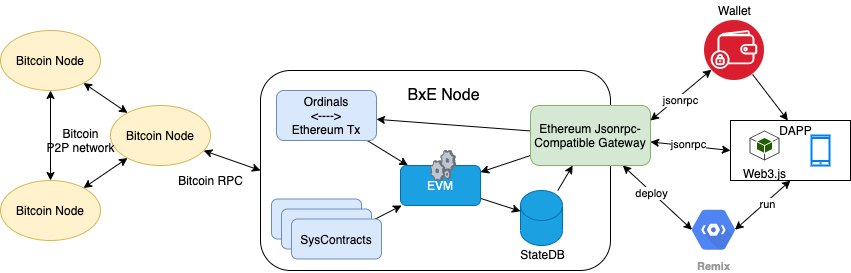

# BxE协议白皮书
## 1. BxE项目背景

区块链技术自诞生以来，为金融、供应链、数字身份等领域带来了变革性的创新。然而，作为第一个成功应用区块链技术的比特币，存在着一些局限性，如较低的交易吞吐量、较高的能源消耗以及有限的脚本功能。这使得比特币在支持复杂应用和智能合约方面显得力不从心。

为了解决这些问题，比特币社区提出了许多解决方案，其中之一便是Ordinals协议。Ordinals协议通过在比特币交易中嵌入数据，使得开发者可以在比特币网络上实现更复杂的逻辑和功能。尽管Ordinals在一定程度上弥补了比特币的不足，但它依然存在一些缺陷，如较低的数据存储效率和较差的互操作性。

此外，随着以太坊和其他智能合约平台的兴起，一种名为BRC-20的新协议应运而生。BRC-20试图在比特币网络上实现类似以太坊的代币发行和交易功能。然而，由于比特币网络和以太坊网络之间的本质差异，BRC-20在性能和安全性方面存在一定的局限。

鉴于此，BxE项目旨在突破现有框架，构建一个基于比特币网络的支持图灵完备智能合约并兼容以太坊生态的新型区块链基础设施。通过引入先进的共识算法、优化数据存储结构以及改进跨链互操作性，BxE项目有望为用户带来更高效、安全且易于使用的区块链服务。

为了实现这一目标，BxE项目采用了以下策略：

1. 利用Ordinals协议在比特币网络上实现智能合约的支持，实现创建智能合约交易、合约调用交易的封装与转换。
2. 通过搭建与以太坊网络兼容的EVM（以太坊虚拟机），实现跨链互操作性，使得以太坊智能合约能够在比特币网络上运行。
3. 设计并实现一套完善的系统合约，包括比特币查询系统合约、Ordinals合约和BRC-20系统合约，为用户提供丰富的功能和便捷的操作体验。
4. 建立一个BxEvm的Jsonrpc网关，方便用户查询合约执行结果、比特币区块和交易信息、Ordinals铭文数据以及BRC-20交易详情。

通过这些措施，BxE项目有望为比特币网络带来新的生机和活力，推动区块链技术在各个领域的广泛应用和发展。

## 2. BxE项目概述
### 2.1 项目目标
**BxE协议(Bitcoin x Ethereum Protocol)** 旨在充分利用比特币强大的安全性、去中心化特性和庞大的网络效应,在其基础上构建一个可编程、跨生态互联的新一代区块链生态系统。通过创新的技术设计,BxE将成为连接比特币与以太坊Web3生态网络的桥梁,推动整个加密经济的发展。

### 2.2 关键创新
基于Ordinals协议,创新性地将以太坊EVM迁移到比特币网络上运行,实现了以太坊dApp与比特币网络的无缝集成。
通过定制设计的BxEVM虚拟机,使得使用Solidity等语言编写的智能合约可直接部署在比特币网络上执行,开启全新的DeFi、NFT等应用场景。
借助Ordinals的数字艺术特性,BxE生态上的NFT不仅具备独特的艺术价值,也能作为金融衍生品进行投资交易。
搭建了BRC-20、BXET等创新型Token协议,使资产在比特币链和以太坊链之间自由流转,促进不同生态的价值整合。
### 2.3 生态愿景
BxE项目将致力于打造一个开放、多元、安全高效的去中心化合约生态。我们将为开发者提供友好的开发工具、完善的技术文档和丰富的社区支持,鼓励社区成员共同参与BxE的建设和发展。同时,我们也将推出官方的钱包、浏览器等工具,方便用户与BxE交互。我们相信,通过BxE的努力,将为全球用户带来更多的创新应用和更佳的区块链体验。
### 2.4 BxE的优势和价值
BxE项目的核心优势和价值主要体现在以下几个方面:
1. 安全性: BxE基于比特币网络Ordinals协议,继承了比特币的安全性和去中心化特性,具有极高的安全性和可靠性，由于无需对现有比特币网络进行任何升级，所以不会引入风险。
2. 去中心化: BxE协议采用了去中心化的设计理念,通过比特币网络进行合约安装、调用的共识和存储，实现了比特币网络无需信任的图灵完备智能合约。
   
3. 互操作性: BxE项目致力于打通比特币网络各大生态如Ordinals铭文、BRC-20等,实现了比特币铭文、域名、NFT、BRC-20等各生态的无缝对接,为用户提供了更多的选择和便利。
4. 可扩展性: BxE协议将以太坊虚拟机引入比特币网络，可以基于EVM图灵完备的特性，将以太坊成熟的Layer2、预言机等特性引入比特币网络,从而在此基础上建立良好的可扩展性和高吞吐量,能够满足不同规模的应用需求。
5. 以太坊Web3生态兼容性: BxE协议以EVM为智能合约执行环境，以以太坊交易格式为合约的安装和调用入口，通过提供兼容以太坊Jsonrpc的网关,在比特币网络为用户带来了比肩以太坊的Web3.0体验和更多的应用场景。
6. 更低的Token转移手续费：在BRC-20协议中，用户要完成一笔转账交易，需要先通过2笔交易完成transfer的铭刻，然后再通过第三笔交易将铭刻的聪转移给收款人，手续费约：154+186+212=552。而在BxE协议中，用户只需要两笔交易完成ERC20合约transfer方法调用的铭刻，手续费约为 154+156=310。

## 3. BxE技术架构
### 3.1 底层基础 - 比特币Ordinals与以太坊EVM
#### 3.1.1 比特币Ordinals
Ordinals是比特币网络的一项革命性拓展方案,允许将任意数据永久性地铭刻到比特币区块链中,打开了在比特币链上发行NFT、发行代币等无限可能。BRC-20协议便是利用了Ordinals的优势,第一次在比特币网络上实现了类似ERC-20的代币标准。
#### 3.1.2 以太坊交易
以太坊交易是以太坊区块链上的基本操作单元，通过它可以在以太坊网络上实现以太币的转账和智能合约的调用。交易是由发送者发起的，经过挖矿节点验证和打包，最终被记录到区块链上的。 
以太坊交易包含了交易的发送者Nonce值、接收者、转账金额、智能合约调用数据、Gas相关信息和发送者对交易的签名（通过前面可以恢复出发送者地址）。
以太坊交易的作用包括：
1. 以太币转账：用户之间可以通过交易将以太币从一个账户转移到另一个账户。
2. 部署智能合约：开发者可以通过交易将智能合约的字节码部署到以太坊网络上，创建一个新的智能合约地址。
3. 调用智能合约：用户可以通过交易向智能合约发送数据，触发智能合约的函数执行。
4. 存储信息：交易的数据字段可以用来在以太坊网络上存储任意信息，实现去中心化的信息存储和传输。
#### 3.1.3 EVM虚拟机
EVM，全称Ethereum Virtual Machine，即以太坊虚拟机，是以太坊区块链的核心部分。它作为一个全局计算设备，用于执行智能合约。EVM允许任何人在以太坊区块链上执行任意复杂的代码，只要他们愿意为执行的计算步骤支付足够的GAS。
EVM执行一次交易或智能合约时，需要以下信息：
1. 调用交易的发送者地址、接收者地址、转账金额、Gas价格、Gas限额、调用数据等信息。
2. 合约的字节码获取接口，即通过地址可获得对应合约的二进制代码。
3. 当前区块的信息，包括：区块高度、难度、时间戳等信息。
4. 历史区块的查询接口，用于根据区块高度获取区块哈希。
5. 账户的状态，包括：账户的余额、合约的存储空间等信息。
6. 智能合约状态数据的读写接口。
### 3.2 BxE整体设计
BxE协议的整体设计如下图所示,它由比特币Ordinals交易与以太坊交易的转换器、BxEVM虚拟机与合约状态数据持久化服务、Bitcoin/Ordinals/BRC-20等多个系统合约和模块组成,并提供了与以太坊Web3生态兼容的网关服务。


### 3.3 从比特币交易中提取以太坊交易
BxE节点通过连接比特币官方钱包或者运营商的RPC服务监听比特币区块链上的Ordinals交易,提取交易中铭刻的内容，该内容主要包含了以太坊交易的Nonce值、Gas价格、Gas限额、接收者、转账金额、智能合约调用数据等数据。
其中的以太坊交易内容不包含签名（R、S、V字段），实际上我们构造的以太坊交易的From字段（也就是交易发起人）是由Ordinals交易中P2TR隔离见证脚本中的公钥部分计算而来。在附加上From字段后，该以太坊交易将发送给BxEVM执行EVM合约的安装、执行等操作。

### 3.4 BxEVM以太坊交易的执行与结果存储
BxEVM是BxE协议的核心组件,它是一个以太坊虚拟机的实现,兼容最新版本以太坊主网的合约逻辑，用于执行以太坊交易中的智能合约。BxEVM的执行结果将被独立记录和存储,而不会写入比特币区块链。
BxEVM的执行除了当前交易外，还需要从状态数据库中读取合约字节码、合约状态数据和用户账户数据，另外BxE协议还提供了比特币交易和区块到BxEVM所需的上下文的映射。BxEvm的执行结果包括合约执行的状态变更、执行结果、Gas消耗、事件日志等信息,这些信息将被存储在BxE节点的本地数据库中,并通过BxE网关服务对外提供查询接口。

### 3.5 系统合约的设计
BxE平台将预置诸如比特币查询、Ordinals查询、BRC-20查询等一系列系统合约,为外部的EVM合约提供查询比特币链上数据的能力。

另外,为了防止BRC-20代币锁定时对其UTXO关联聪的锁定，BxE协议还定义了一个BTC-ERC20合约，当任意数量的BTC被锁定时，BTC-ERC20合约可以mint对应数量的WBTC实现了BTC的跨协议流转。

通过以上系统合约的设计，BxE连接各种比特币生态,为BxE上的dApp与智能合约也其他比特币生态进行互操作和对接提供了天然的桥梁。
#### 3.5.1 比特币查询合约
比特币查询合约允许用户查询比特币区块头、交易、地址余额等信息。
合约地址：0x0000000000000000000000000000000000000001
```solidity
contract Bitcoin {
    //getBlockHeader 根据传入的区块高度获取比特币区块头
    function getBlockHeader(uint256 height) public view returns (bytes memory);
    //getTransaction 根据传入的交易ID获取比特币交易
    function getTransaction(uint256 txid) public view returns (bytes memory);
    //getBalance 根据传入的地址获取比特币余额
    function getBalance(address addr) public view returns (uint256);
    //getUtxo 根据传入的地址获取其比特币UTXO列表
    function getUtxo(address addr) public view returns (bytes memory);
}
```
#### 3.5.2 Ordinals查询合约
Ordinals管理合约允许用户查询、验证、解析比特币区块中的Ordinals数据。
合约地址：0x0000000000000000000000000000000000000002
```solidity
contract Ordinals {
    //getInscriptionById 根据传入的铭文ID获取铭文信息，包括铭文对应聪编号、铭文内容、大小、创建时间、创建高度、创建者、当前拥有者等 
    function getInscriptionById(uint256 inscriptionId) public view returns (bytes memory);
    //getInscriptionBySatNumber 根据传入的聪编号获取铭文信息
    function getInscriptionBySatNumber(uint256 satNumber) public view returns (bytes memory);
    //getCollection 根据传入的序号获取铭文集合 
    function getCollection(uint256 ordinal) public view returns (bytes memory);
    //getInscriptionTransaction 根据传入的交易ID获取铭文交易信息
    function getInscriptionTransfer(bytes txHash) public view returns (address from, address to, uint256 satNumber, bytes txData);
}
```
#### 3.5.3 BRC-20查询合约
BRC-20合约是Ordinals上的代币标准,允许用户定义、发行、转账等操作。
合约地址：0x0000000000000000000000000000000000000003
```solidity
contract BRC20 {
    //getDeploy 根据传入的交易ID获取代币部署信息，包括代币名称、总发行量、单次挖矿限额等
    function getDeploy(bytes txHash) public view returns (string token, uint256 totalSupply,uint256 limit);
    //getMint  根据传入的交易ID获取代币铸币信息，包括代币名称、铸币者、铸币数量
    function getMint(bytes txHash) public view returns (string token,address owner, uint256 value);
    //getTransfer 根据传入的交易ID获取代币转账信息，包括代币名称、转出地址、转入地址、转账数量
    function getTransfer( bytes txHash) public view returns (string token,address from, address to, uint256 value);
}
```

#### 3.5.4 BTC-ERC20合约
Bitcoin ERC20合约又称WBTC合约，是Bitcoin的Wrapped形式并满足ERC20接口标准，当BTC在比特币网络锁定时，该合约则可Mint出对应数量的WBTC。
合约地址：0x0000000000000000000000000000000000000004
```solidity
contract BitcoinERC20 {
    //满足ERC20
    function name() public view returns (string);
    function symbol() public view returns (string);
    function decimals() public view returns (uint8);
    function totalSupply() public view returns (uint256);
    function balanceOf(address account) public view returns (uint256);
    function transfer(address recipient, uint256 amount) public returns (bool);
    function allowance(address owner, address spender) public view returns (uint256);
    function approve(address spender, uint256 amount) public returns (bool);
    function transferFrom(address sender, address recipient, uint256 amount) public returns (bool);
    //Event
    event Transfer(address indexed from, address indexed to, uint256 value);
    event Approval(address indexed owner, address indexed spender, uint256 value);
    //mint 传入锁定BTC的交易哈希，系统判断从比特币网络锁定的BTC后，可在BxE上铸造对应数量的WBTC
    function mint(bytes txHash) public returns (bool);
}
```
### 3.6 BxE Token的设计
BXET(Bitcoin x Ethereum Virtual Machine Token简称BXET)是BxE协议与生态系统的核心加密数字资产,BXET在BxE协议上线时一次性发行完毕，BxEVM的执行过程中扮演了重要的角色,主要用于支付智能合约部署、合约调用、BXET转账等的手续费。
为了保证BxE与以太坊的兼容性，BXET与以太坊Gas费用的设计保持一致,即用户在BxE上执行智能合约时,需要支付一定数量的BXET作为手续费。BXET做为手续费直接销毁,不会进入任何人的账户。
在BxE交易中，Gas单价默认为1 GWei，小于这个单价的交易将被标记为无效而无法执行。单笔交易的Gas限额的上限为15,000,000，超过该限额的交易将被标记为无效而无法执行。
#### 3.6.1 正常交易的手续费扣除
以转账交易为例，假设用户A有2个BXET，需要转账1个BXET给用户B，当前Gas单价为1 GWei，转账需要消耗21000 Gas，于是手续费是：
`21000*1*10^-9=0.000021BXET`
转账成功打包上链后，用户A的账户中将剩余0.999979BXET，用户B的账户余额是1BXET。
#### 3.6.2 无效交易
当用户账户的BXET余额不足以支持对应的交易（比如账户余额只有1BXET却构造转账2BXET的交易）或者账户余额不足以支付对应的Gas限额费用（比如账户余额只有1BXET却构造转账1BXET的交易，剩余的账户余额不足以支付手续费）时，交易无需执行即可被判断并被标记为无效。
无效的交易不扣除BXET。
比如用户A有1个BXET，转账0.999999BXET给用户B，当前Gas单价为1 GWei，转账需要消耗21000 Gas，于是手续费是：
`21000*1*10^-9=0.000021BXET`
0.999999BXET+0.000021BXET=1.00002BXET>1BXET
所以转账失败，状态数据不变，用户A的账户中将剩余1BXET。
#### 3.6.3 Out of Gas交易
如果用户构造的交易的Gas限额不足以支持EVM运行所需的Gas消耗，那么交易将被标记为Out of Gas，合约状态不会更新，但用户的BXET余额将会被扣除。
假如用户A有1个BXET，需要调用某个合约方法，并设置Gas限额100000，当前Gas单价为1 GWei，实际合约调用成功需要消耗110000 Gas，所以合约调用会返回Out of Gas。
手续费为：`100000*1*10^-9=0.0001BXET`
最终合约调用失败，状态数据不变，用户A的账户中将剩余0.9999 BXET。

### 3.7 BxE交易的生成与上链
当用户需要转账BXET、创建EVM合约或者调用EVM合约时,用户需要构造一个以太坊交易,并将其进行RLP编码（这是以太坊相关工具提供的能力）。接下来，用户无需对这个编码后的以太坊交易签名，而是将这个交易数据放入Ordinals协议中，构造出铭刻脚本和对应的P2TR地址。
接下来用户将一定数量的BTC转入P2TR地址,这个转账BTC的交易可以进行广播。
最后，用户无需等待比特币网络的打包确认，用户即可再次构造从P2TR地址到自己地址的交易，将包含以太坊交易的脚本铭刻到比特币网络，用户对这个交易签名并广播。
当两笔交易被比特币网络打包到区块中时，所有BxE节点将会订阅对应的新区块和交易并解析执行其中的以太坊交易，完成各个BxE节点状态数据的更新。

### 3.8 BxE对以太坊生态的兼容性
BxE协议对外提供与以太坊JSON-RPC接口兼容的网关服务,用户可以通过该网关查询BxE节点上的合约状态和执行结果。


这种设计带来的主要优势是:

充分利用了比特币网络出色的安全性、去中心化程度和全球共识,使得合约执行的数据源具有很高的可靠性和确定性。

将合约执行和状态存储与记账分离,避免了把所有计算和存储都放在链上,从而提高了系统吞吐量和扩展性。

由于BxE协议开源透明,任何第三方都可以部署BxE节点参与网络,形成了天然的数据去中心化和冗余备份。

通过网关服务,为外部应用提供了与以太坊生态无缝兼容的接口,使得现有dApp可以无缝迁移到BxE平台。

BxE项目方将推出官方的钱包、浏览器等工具,方便用户与BxE交互。同时也鼓励社区开发更多基于BxE协议的产品和服务,打造一个开放、多元、安全高效的去中心化合约生态。
## 4. BXET Token经济模型
### 4.1 代币发行机制
BXET的发行总量为10亿枚,其中20%用于公开发行,另外50%作为运营储备逐年解锁,剩余30%留作社区激励与生态基金。
BXET(Bitcoin x Ethereum Virtual Machine Token简称BXET)是BxE生态系统的核心加密数字资产,
在融资阶段BXET通过BRC-20和ERC20在比特币链和以太坊链上进行锚定，在BxE生态系统运行后转入BxE平台。

### 4.2 代币用途
BXET将作为BxE平台内部的Gas费用支付通证,用于支付智能合约部署、合约调用等手续费。此外,BXET还将作为生态系统权益证明参与社区治理投票。

### 4.3 Gas费用与激励机制
与以太坊类似,在BxE平台上使用智能合约需要消耗一定Gas费用,并按当前Gas Price折算成相应BXET数量从用户账户扣减。BxE的交易被打包后,所有的Gas费用将被销毁,不会进入任何人的账户。

### 4.4 代币分配与使用计划
公开发售所得BXET将主要用于基础设施建设、生态拓展、市场营销等。运营储备部分将稳步解锁,用于社区激励、生态扶持等目的。同时公司也将设立生态发展基金,从中调拨BXET支持优秀的dApp和服务提供商。

## 5. BxE生态发展路线图
### 5.1 开发路线图
BxE的技术开发将分为以下几个阶段:
* 第一阶段研发BxEVM虚拟机，支持在BxEVM上运行任意EVM兼容智能合约;
* 第二阶段研发兼容以太坊生态的Jsonrpc网关和钱包，实现智能合约的部署与调用交易的上链;
* 第三阶段研发系统合约，打通比特币网络上的BTC交易、Ordinals铭文、BRC-20等生态;
* 第四阶段打造完整的BxE生态，迁移成熟的以太坊Web3生态，引入预言机、ZKRollup等机制，实现高吞吐量和低成本的智能合约执行。
* 第五阶段支持原生Rollup，将用户的BxE交易进行Rollup，批量打包上链到比特币网络，从而实现更高的吞吐量和更低的成本。

### 5.2 生态拓展计划
BxE项目将着力在比特币网络上打通现有的铭文、BRC-20等生态，促进比特币生态资产的流通，并进一步打造一个充满活力的dApp生态,涵盖DeFi借贷、DEX交易所、NFT市场、GameFi、SocialFi等多种应用范畴。项目方将为优质项目提供BXET代币的生态基金支持,并有机会参与BxE的空投和激励机制。

### 5.3 治理结构
为实现BxE平台的长期可持续发展,项目方将逐步推行去中心化治理模式。将来社区成员可凭借持有BXET数量参与重大决策的提案和投票,主导平台的发展路线。同时项目方也将邀请行业专家和社区贡献者加入治理委员会。

## 6. 团队介绍
### 6.1 创始团队成员
### 6.2 顾问委员会

## 7. 融资计划
### 7.1 募资目标与用途
本次BxE项目的BXET代币发行总量为10亿枚,其中5亿以BRC-20协议发行在比特币网络，另外5亿以ERC20标准发行在以太坊网络。所募集资金的用途分配如下:

30%用于核心技术研发,包括BxEVM虚拟机、系统合约、开发工具链等基础架构建设
25%用于营销运营,包括品牌推广、社区拓展、生态激励等
20%用于生态基金设立,为优质dApp项目和技术合作伙伴提供支持
15%用于合规性支出,包括法律咨询、审计认证等
10%作为运营储备,用于日常办公和人员支出
### 7.2 投资者权益

## 8. 风险因素
### 8.1 技术风险
尽管BxE项目团队已作了大量工作,但仍存在技术研发不及预期、产品存在漏洞缺陷等风险。我们将组建专业的安全审计团队,对所有代码进行全面检查。同时制定了完善的应急响应流程,以降低此类风险。

### 8.2 监管风险
加密货币监管在全球范围内存在不确定性,项目面临潜在的监管合规风险。我们将聘请资深法律顾问,并遵从最高的合规标准。同时与各地监管机构保持良好沟通,确保项目合法合规。

### 8.3 其他风险
包括但不限于团队人员变动风险、竞争对手风险、虚拟货币市场剧烈波动风险等因素,都可能在一定程度上影响本项目的发展。公司已为这些风险制定应对预案,与投资者利益保持高度一致。

## 9. 免责声明
BxE项目方在此声明,本白皮书并非作为投资建议或游说购买证券的邀约,投资人须自行承担投资风险。本白皮书部分陈述可能存在前瞻性假设,存在不确定性。实际发展情况可能与预期存在差异。项目方对于由此产生的任何经济损失不承担责任。

# 附录
## 附录A BRC-20 Token跨到BxE的过程
BxE协议支持BRC-20 Token转移到BxE上，以ERC20 Token的形式存在。

要实现BRC-20到ERC20的兑换，需要定义一个锁定地址，该锁定地址可以是一个黑洞地址，如果使用黑洞地址作为锁定地址，那么将支持单向的BRC-20 Token转移到BxE协议上，以ERC20 Token的形式存在。
如果希望实现双向的BRC-20 Token转移到BxE协议上，那么可以采用多签地址或者某个可信地址作为锁定地址。

以知名的BRC-20 ORDI为例，跨到BxE协议的过程如下：
1. 编写并部署一个满足ERC20规范的代币合约WORDI（Wrapped ORDI）到BxE上。该合约初始发行量为0，具有mint方法。
2. 用户A持有一定数量m的ORDI，构造ORDI的转账交易，将n个ORDI转移到锁定地址，并记录下该锁定ORDI的交易哈希。
3. 在BxE上发起调用WORDI合约的mint方法的交易，将上一步锁定ORDI的交易哈希作为参数传入。
4. 用户的mint交易被打包到比特币网络，BxE节点执行合约合约mint逻辑：
    a. 判断交易哈希是否已经在之前被处理，如果处理过则返回错误。 
    b. 跨合约调用BRC-20系统合约0x0000000000000000000000000000000000000003的getTransfer方法，获得锁定交易的发起人、锁定Token的数量、锁定Token的Symbol。
    c. 判断锁定的Token的Symbol是不是ORDI，不是则返回错误。
    d. 判断Token的收款人地址是不是锁定地址，不是则返回错误。
    e. 调用ERC20自身的铸币方法`function _mint(address to, uint256 amount)`，为锁定交易的发起人铸造对应锁定数量的WORDI Token。

WORDI的铸造逻辑如图：


## 附录B BTC跨到BxE的过程
BxE协议支持BTC转移到BxE上，以ERC20 Token（WBTC）的形式存在。

要实现BTC到ERC20的兑换，需要定义一个锁定地址，该锁定地址可以是一个黑洞地址，如果使用黑洞地址作为锁定地址，那么将支持单向的BTC转移到BxE协议上，以ERC20 Token（WBTC）的形式存在。
如果希望实现双向的BTC转移到BxE协议上，那么可以采用多签地址或者某个可信地址作为锁定地址。

以下是BTC跨到BxE协议的过程：
1. 用户A持有一定数量m的BTC，构造BTC的转账交易，将n个BTC转移到锁定地址，并记录下该锁定BTC的交易哈希。
2. 在BxE上发起调用BTC-ERC20系统合约的mint方法的交易，将上一步锁定BTC的交易哈希作为参数传入。
3. 用户的mint交易被打包到比特币网络，BxE节点执行合约合约mint逻辑：
    a. 判断交易哈希是否已经在之前被处理，如果处理过则返回错误。 
    b. 跨合约调用BTC系统合约0x0000000000000000000000000000000000000001的getTransaction方法，获得锁定交易的发起人地址、收款人地址、锁定BTC的数量。
    c. 判断BTC的收款人地址是不是锁定地址，不是则返回错误。
    d. 判断BTC的锁定数量是否大于零，不是则返回错误。
    e. 调用自身的铸币方法`function _mint(address to, uint256 amount)`，为锁定交易的发起人铸造对应锁定数量的WBTC。

WBTC的铸造逻辑如图：
